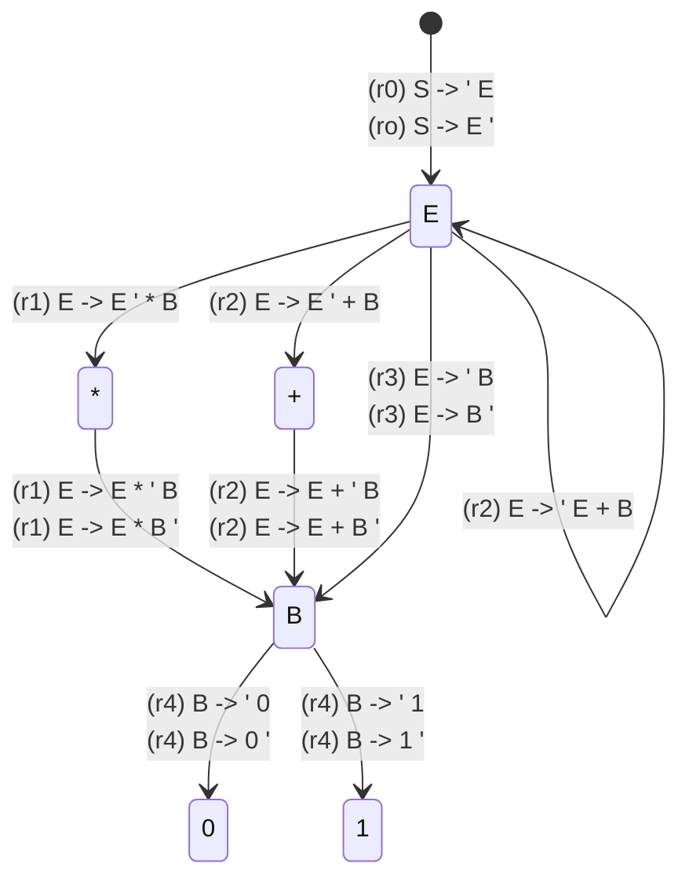

| Rule # |  Production  | States |     |     |
| :----: | :----------: | :----: | :-: | :-: |
|   0    |   Φ -> ' E   |   0    |     |     |
|   0    |   Φ -> E '   |   4    |     |     |
|   -    |      -       |   -    |     |     |
|   1    | E → ' E \* B |   0    |     |     |
|   1    | E → E ' \* B |   4    |     |     |
|   1    | E → E \* ' B |   5    |     |     |
|   1    | E → E \* B ' |   7    |     |     |
|   -    |      -       |   -    |     |     |
|   2    | E → ' E + B  |   0    |     |     |
|   2    | E → E ' + B  |   4    |     |     |
|   2    | E → E + ' B  |   6    |     |     |
|   2    | E → E + B '  |   8    |     |     |
|   -    |      -       |   -    |     |     |
|   3    |   E → ' B    |   0    |     |     |
|   3    |   E → B '    |   3    |     |     |
|   -    |      -       |   -    |     |     |
|   4    |   B → ' 0    | 0 5 6  |     |     |
|   4    |   B → 0 '    |   1    |     |     |
|   -    |      -       |   -    |     |     |
|   5    |   B → ' 1    | 0 5 6  |     |     |
|   5    |   B → 1 '    |   2    |     |     |

next(state 0) = {0, 1, B, E}
next(state 1) = {}
next(state 2) = {}
next(state 3) = {}
next(state 4) = {+, \*}
next(state 5) = {0, 1, B}
next(state 6) = {0, 1, B}
next(state 7) = {}
next(state 8) = {}

if next is terminal: mark remaining items that advanced next
else: mark remaining items that define next

0
START -> ' E
predict E → ' E \* B
predict E → ' E + B
1
advance START -> E '
2
advance E → E ' \* B

3
advance E → E ' + B
4
advance E → E \* ' B
advance E → E + ' B
predict B → ' 0
predict B → ' 1
3
advance B → 0 '
advance B → 1 '
advance E → E \* B '
advance E → E + B '
